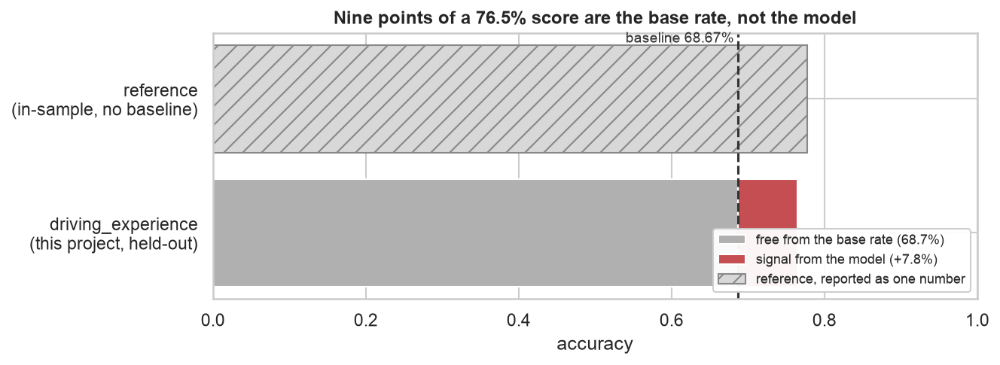
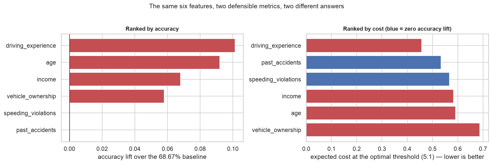
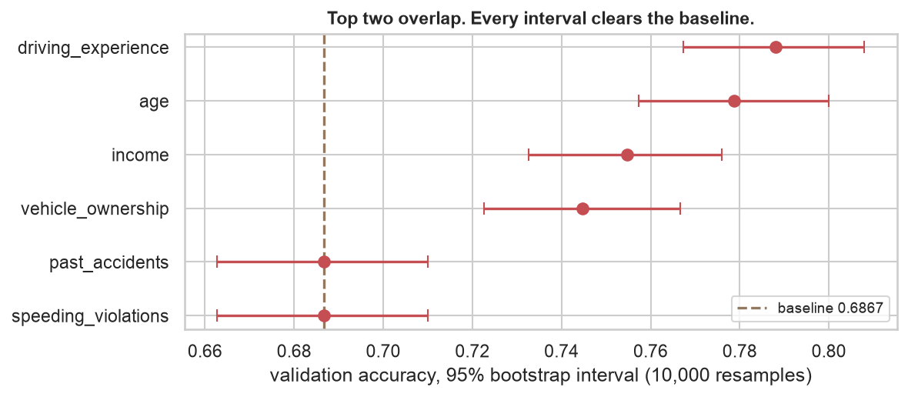

# Car Insurance Claim Outcomes

**Which single customer attribute best predicts an insurance claim — and is the answer
actually better than guessing?**

An insurer with no ML infrastructure asked for one feature they could threshold on. A
public solution to this problem reports **77.71% accuracy** for driving experience. This
project rebuilds the evaluation that number is missing, and finds that most of it was
never the model's to claim.

> **Headline result.** On 1,500 held-out customers, `driving_experience` predicts claims
> with **76.47% accuracy** against a **68.67% majority-class baseline** — a lift of
> **+7.80 points**, 95% CI **[+5.66, +9.93]**, beating the baseline in 10,000 of 10,000
> bootstrap resamples.
>
> The reference reports 77.71% without stating that predicting "no claim" for everyone
> scores 68.67%. **Nine of those points are the base rate.**
>
> And the winner does not really win: its margin over `age` has a 95% CI of
> **[−0.010, +0.029]**. The two are statistically indistinguishable.

Python · statsmodels · scikit-learn · pandas · 42 tests



---

## Results

One held-out test set of 1,500 customers, scored once, after every choice was fixed on
validation.

| Model | Accuracy | Baseline | Lift | ROC-AUC | Precision | Recall | Cost @ 5:1 |
|---|---|---|---|---|---|---|---|
| **`driving_experience` @ 0.5** | **0.7647** | 0.6867 | **+0.0780** | 0.7938 | 0.607 | 0.704 | 0.606 |
| `driving_experience` @ 0.05 (cost-optimal) | 0.5993 | 0.6867 | −0.0874 | 0.7938 | 0.436 | 0.945 | **0.470** |
| All 15 features @ 0.5 (ceiling) | 0.8233 | 0.6867 | +0.1366 | 0.8778 | 0.724 | 0.704 | 0.547 |
| All 15 features @ 0.16 (cost-optimal) | 0.7220 | 0.6867 | +0.0353 | 0.8778 | 0.533 | 0.909 | **0.393** |

Validation accuracy for the recommended model was 0.7880. The 2.3-point drop on test is
selection optimism — the feature was *chosen* on validation — and exposing it is what the
split is for.

Reproduce every number:

```bash
python scripts/run_experiment.py
```

---

## What I found, and what it means

### 1. Most of a 77% accuracy score is free

The target is 31.33% positive. Predicting "no claim" for every customer scores 68.67%
without a model at all.

The reference never states this, so a reader cannot tell whether 77.71% represents ten
points of signal or none. It represents about nine — real, useful, and roughly a tenth of
what the headline number implies.

Every accuracy in this repository is reported next to that floor.

### 2. The metric chooses the answer

Nine of sixteen features score **exactly** 68.67% with a predicted-positive rate of zero.
They classify every customer as "no claim." They score the baseline because they *are* the
baseline.

Two of them are not weak features at all. `speeding_violations` (AUC 0.732) and
`past_accidents` (AUC 0.726) rank customers by risk better than `vehicle_ownership` or
`credit_score`, both of which *do* beat the accuracy baseline. They were penalised for
never crossing an arbitrary 0.5 cut-off.

Score on expected cost instead, with a missed claim costing 5× a false alarm, and they
place second and third:



Three consequences follow:

- **The optimal threshold is never 0.5.** It is 0.25 even at symmetric cost, because the
  classes are imbalanced, and 0.05 at 5:1.
- **At the cost-optimal threshold, accuracy falls to 61.3%** — below the baseline. A model
  tuned for business cost looks worse on the client's chosen metric. Both are correct;
  they answer different questions.
- **The baseline itself flips.** Under 5:1, "always predict claim" costs 0.687 and "always
  predict no claim" costs 1.567. The majority-class yardstick is not a fixed property of
  the data.

Tuning the threshold is worth more than choosing the feature.

### 3. The winner is tied with the runner-up

`driving_experience` beat `age` by 0.93 points on validation. A paired bootstrap over
10,000 resamples puts the 95% interval for that gap at **[−0.010, +0.029]** — spanning
zero, with `driving_experience` ahead in 82% of resamples.



The lift over baseline is not in doubt; the ranking within the top two is. This was
foreshadowed in the EDA: `age` spreads the outcome slightly *wider* (0.627 vs 0.612), the
two have a Cramér's V of 0.668, and their crosstab is triangular, since a 16-25 year old
cannot have 30 years of driving experience. Two features encoding the same underlying
fact are hard to separate.

The reference names one as *the* answer with no interval attached. It picked the right
neighbourhood and expressed more confidence than the data supports.

### 4. One postal code is not a feature, it is an artifact

All **120** customers in postal code 21217 filed a claim — 100%, in the training,
validation and test splits alike. Their credit scores, mileage and ages are unremarkable,
so nothing in their risk profile explains it.

It causes textbook perfect separation. The coefficient diverges to **22.3** on the
log-odds scale — an odds ratio near 4.7 billion — and the optimiser fails to converge.
As a model it posts precision **1.000** and recall **0.045**: it flags only the 21217
customers and is never wrong, because in this dataset that postal code *is* the outcome.

It beats the baseline by 1.4 points and must never be shipped. Its AIC is withheld rather
than reported, because a diverged likelihood does not have one.

A quieter bug sits underneath: `postal_code` is stored as an integer, so a dtype-driven
pipeline fits a linear slope across 10238, 21217, 32765, 92101. Those are labels, and
that arithmetic is meaningless.

### 5. Two defects that turned out not to matter — reported anyway

**Imputation leakage.** The reference computes medians over all 10,000 rows. Fitting on
train only changes the `credit_score` median by 0.001 and `annual_mileage` not at all.
Downstream it flips **one validation prediction in 1,500**. Immaterial here — and you
cannot know that without measuring it.

**Encoding by dtype.** The reference silently compares a 4-parameter model
(`driving_experience`, auto-expanded into dummies) against a 2-parameter one (`age`, left
as an int). Applying both encodings uniformly produces **identical accuracy** for every
feature and the same ranking, because only one level of each ordinal sits above a 50%
claim rate and both schemes agree on which. AIC is not blind to it: `age` gains 53.5 AIC
points from dummy encoding.

Reporting these at their real size, rather than inflating them, is part of the point.

### 6. What the one-feature constraint costs

A model using all 15 usable features reaches **82.33%** accuracy and AUC **0.878** on
test, against 76.47% and 0.794 for the single feature.

**The constraint costs about 6 accuracy points, 0.08 AUC, and 20% higher expected cost.**
Whether that is worth paying is the client's decision — but it should be a decision, not
an assumption, and now it has a number attached.

---

## What this does not show

- **The dataset is synthetic.** The 100% claim rate in one postal code proves it. Effect
  sizes here should not be read as facts about real drivers.
- **One split, one seed.** Every number comes from a single seeded 70/15/15 split.
  Repeating across seeds would separate real effects from split luck.
- **The 5:1 cost ratio is assumed, not measured.** It is a stated input. Real claim
  severities would change the optimal threshold, though not the shape of the argument.
- **Probability calibration is unverified.** Brier scores are reported but reliability
  curves were not plotted, and the threshold analysis assumes the probabilities mean what
  they say.
- **No causal claim.** `driving_experience` predicts claims. Nothing here says it causes
  them, and `age` predicts them about as well.

---

## Reproducing this

Requires Python 3.12.

```bash
git clone https://github.com/matthewpeters-extended/Modeling-Car-Insurance-Claim-Outcomes.git
```

Then, from the project root:

```bash
python3.12 -m venv .venv && .venv/bin/pip install -r requirements.txt
```

Regenerate every published table from the raw CSV — deleting `data/processed/` first is a
fair test, and all 11 tables return byte-identical:

```bash
.venv/bin/python scripts/run_experiment.py
```

Run the tests:

```bash
.venv/bin/python -m pytest -q
```

Full setup notes are in [docs/SETUP.md](docs/SETUP.md).

---

## Repository layout

```
├── README.md                  this file
├── PLAN.md                    the plan, written before any analysis, with findings appended
├── WALKTHROUGH.md             the narrative: what I tried, what broke, what I got wrong
├── data/raw/                  car_insurance.csv, 10,000 rows, committed
├── data/processed/            every published result table, regenerated by one command
├── docs/                      provenance, data dictionary, setup, the reference notebook
├── notebooks/                 01 EDA - 05 results, executed with outputs
├── reports/figures/           the figures this README embeds
├── scripts/run_experiment.py  regenerates every table from the raw CSV
├── src/                       config, data contract, features, metrics, models, plots
└── tests/                     42 tests: the split, the encoding, the metrics
```

The notebooks tell the story; `src/` holds the logic; `scripts/run_experiment.py` is the
reproducibility guarantee. The seed, split ratios, feature taxonomy and cost ratio all
live in [`src/config.py`](src/config.py) so the experimental setup can be audited without
reading the pipeline.

---

## Attribution

The problem, the dataset and the starting point come from the DataCamp guided project
*Modeling Car Insurance Claim Outcomes*, via a public solution by
**[AchrafSL](https://github.com/AchrafSL/Modeling-Car-Insurance-Claim-Outcomes-DataCamp)**.
That notebook is committed unmodified at
[`docs/reference_solution.ipynb`](docs/reference_solution.ipynb) so the comparison can be
checked rather than taken on trust.

**What I changed:** added a held-out train/validation/test split, stated the
majority-class baseline, fitted imputation on training data only, replaced dtype-driven
encoding with an explicit feature taxonomy, added ROC-AUC, precision, recall, AIC and
cost-sensitive thresholds, bootstrapped confidence intervals, detected and quarantined the
`postal_code` separation, and added a test suite and a one-command reproduction path.

**Why the numbers differ:** the reference reports in-sample accuracy on all 10,000 rows.
This project reports held-out accuracy on 1,500 rows the models never saw. 77.71% and
76.47% are not competing estimates of the same quantity — one is training fit, the other
is generalisation.

The reference's conclusion — that driving experience is the strongest single predictor —
**survives this rebuild**, with the qualification that it is tied with `age`. Confirming
someone's answer with better evidence is the more common outcome of this kind of work
than overturning it, and it is what happened here.
